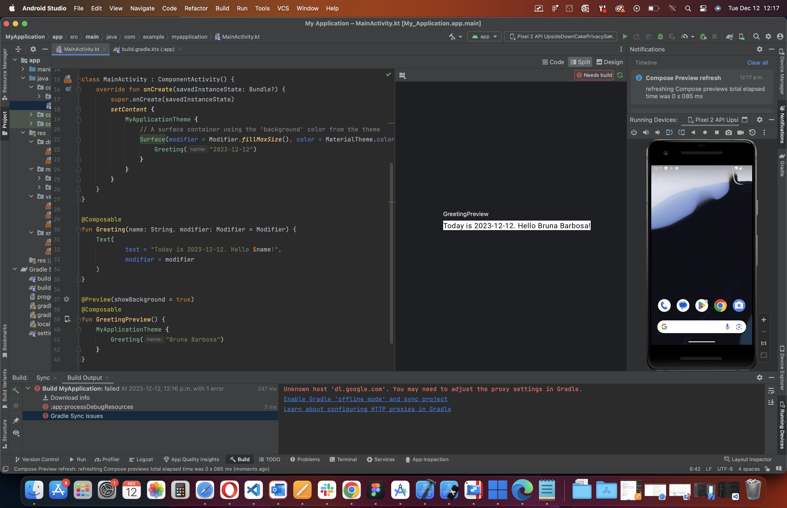
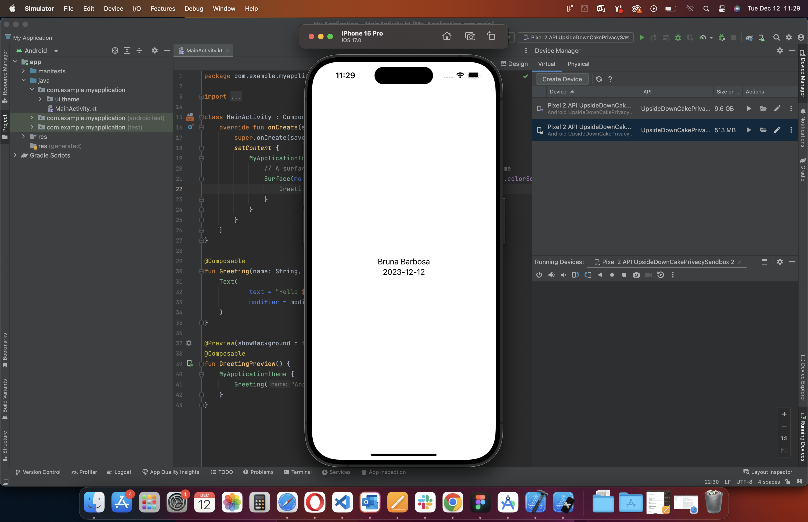

# Bruna_Barbosa_FinalProject

# let arr = [10, 15, 14, 12, 10];
# function average(arr){
#   for(i=0; i < arr.length ; i>++) {
#       let sum = arr.Math.average()=((max*min) + 1) - min;
#      return sum;
#   }
# }

console.log(average);

